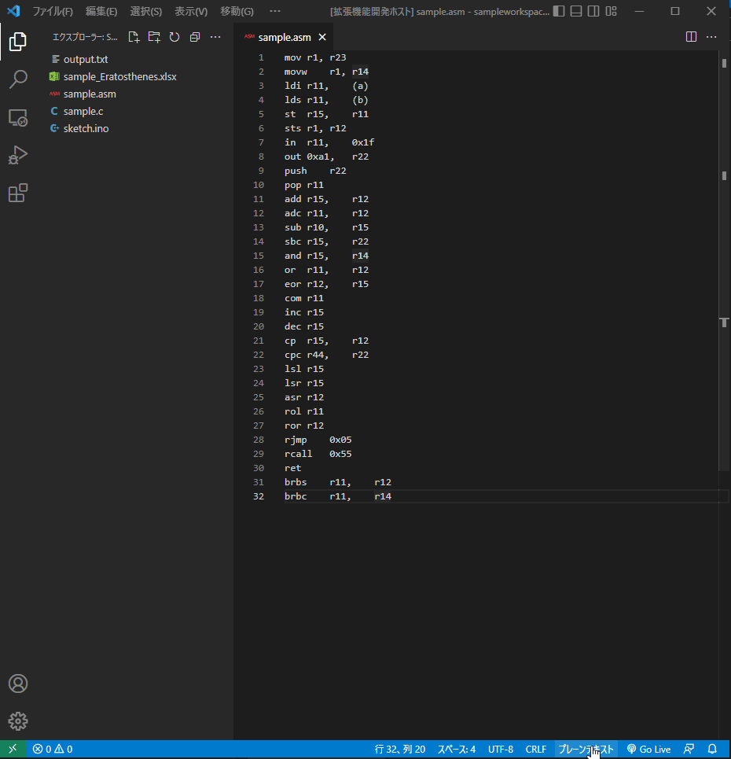
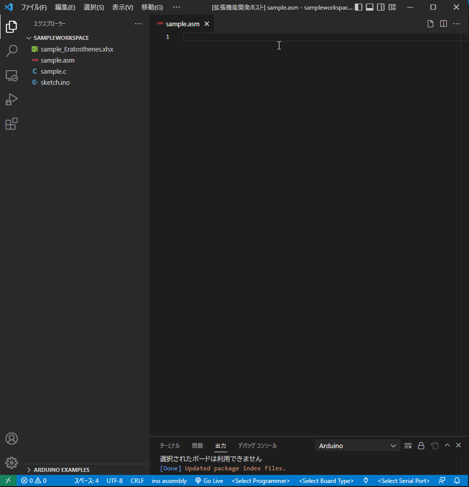
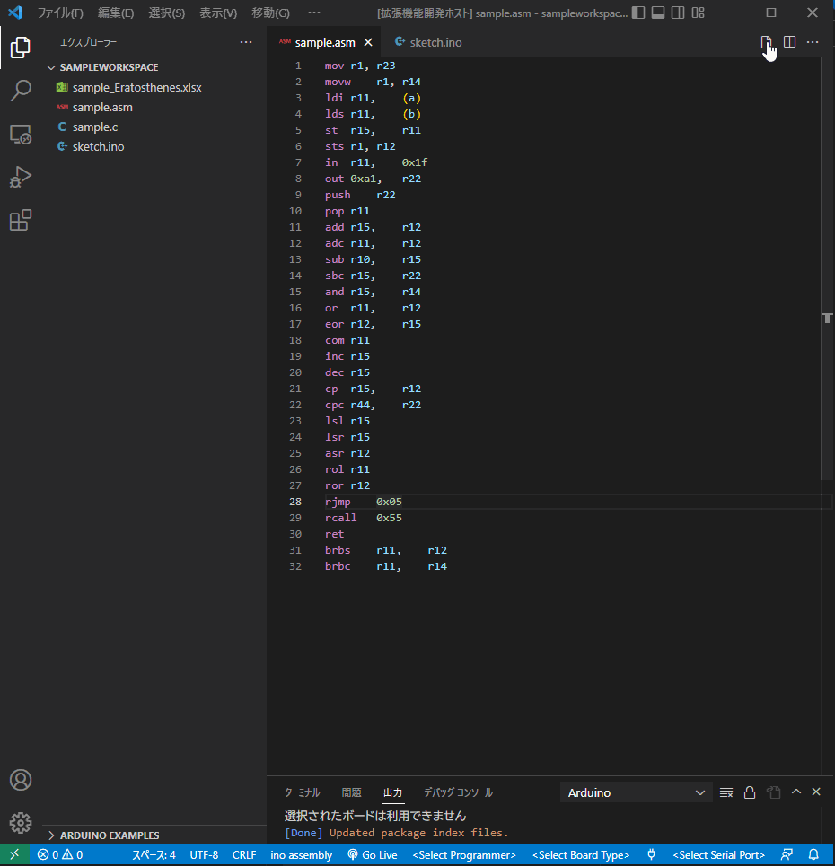

# ATmega328p Assembly Language Editor for Arduino Uno
## 機能
* コードの色付け機能（SyntaxHiglighting）

起動方法：
    1. [ファイル名].asmファイルを作成。
    2. 言語を"ino assembly"に変更。
* 入力補完機能（Code Snippets）

※ 予測変換を使用する際、マウスを使わずに、十字キーで選択、Tabキーで挿入することができる。
* テキスト出力機能

使い方：
    1. [ファイル名].asmの編集が完了した後、右上の「.asmのコードを.ino用に出力する」ボタンをクリック。
    2. output.txtに、`asm();`で使用できるテキストが使用できる。
    3. [ファイル名].inoで、`asm();`内にoutput.txtの内容をコピーする。

## 必要環境
- [Node.js]
* [Arduino IDE](https://www.arduino.cc/en/software)
* [Arduino 拡張機能](https://marketplace.visualstudio.com/items?itemName=vsciot-vscode.vscode-arduino)
* [C/C++拡張機能](https://marketplace.visualstudio.com/items?itemName=ms-vscode.cpptools)

## Release Notes
### Ver.0.1.0
* 初リリース。